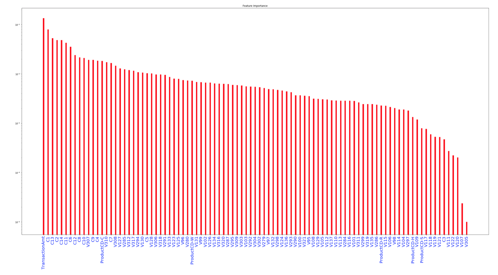

# FRAUD_DETECTION

### Problem Statement: Build a logistic regression model using Scikit-learn to predict fraudulent transactions by training the dataset.

### Dataset Description:

###### IEEE - CSI FRAUD DETECTION

###### LINK TO DATASET - https://www.kaggle.com/c/ieee-fraud-detection/data

###  Classification Chart and Confusion Matrix

### Feature Importance Analysis

